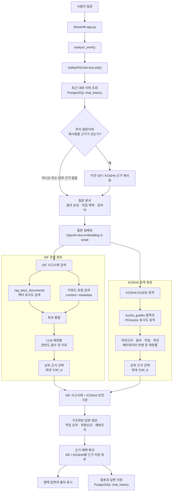

# RAG 구조도

현재 `app.py`에서 사용하는 RAG 흐름입니다. SIF 사고사례와 KOSHA GUIDE를 각각 검색하고, 검색 근거를 바탕으로 구조화된 안전 분석 답변을 생성합니다.

```mermaid
flowchart TD
    U["사용자 질문"] --> APP["Streamlit app.py"]
    APP --> ENTRY["analyze_work()"]
    ENTRY --> ASK["SafetyRAGService.ask()"]

    ASK --> HIST["최근 대화 이력 조회<br/>PostgreSQL chat_history"]
    HIST --> FOLLOW{"후속 질문이며<br/>재사용할 근거가 있는가?"}
    FOLLOW -- "예" --> REUSE["이전 SIF / KOSHA 근거 재사용"]
    FOLLOW -- "아니오 또는 일부 근거 없음" --> QANALYZE["질문 분석<br/>질의 보강 · 작업 맥락 · 검색어"]
    REUSE --> QANALYZE

    QANALYZE --> EMBED["질문 임베딩<br/>OpenAI text-embedding-3-small"]
    EMBED --> SIF["SIF 사고사례 검색"]
    EMBED --> KOSHA["KOSHA GUIDE 검색"]

    subgraph SIFDB["SIF 검색 경로"]
        SIF --> SIFV["rag_day1_documents<br/>벡터 유사도 검색"]
        SIF --> SIFKW["키워드 포함 검색<br/>content / metadata"]
        SIFV --> SIFPOOL["후보 통합"]
        SIFKW --> SIFPOOL
        SIFPOOL --> SIFRERANK["LLM 재정렬<br/>관련도 점수 및 이유"]
        SIFRERANK --> SIFTOP["상위 근거 선택<br/>최대 TOP_K"]
    end

    subgraph KOSHADB["KOSHA 검색 경로"]
        KOSHA --> KOSHAV["kosha_guides 컬렉션<br/>PGVector 유사도 검색"]
        KOSHAV --> KOSHAMETA["카테고리 · 설비 · 작업 · 섹션<br/>메타데이터 반영 및 재정렬"]
        KOSHAMETA --> KOSHATOP["상위 근거 선택<br/>최대 TOP_K"]
    end

    SIFTOP --> EVIDENCE["SIF 사고사례 + KOSHA 안전기준"]
    KOSHATOP --> EVIDENCE
    EVIDENCE --> ANSWER["구조화된 답변 생성<br/>작업 요약 · 위험요인 · 예방조치"]
    ANSWER --> GATE["근거 채택 확인<br/>SIF / KOSHA별 근거 지원 여부"]
    GATE --> DISPLAY["앱에 답변과 출처 표시"]
    GATE --> SAVE["질문과 답변 저장<br/>PostgreSQL chat_history"]
```

> 통계 데이터 조회는 `app.py`의 별도 경로이며, 위 다이어그램의 RAG 검색 흐름에는 포함하지 않았습니다.
